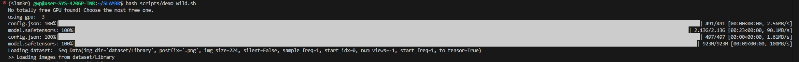
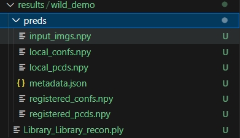
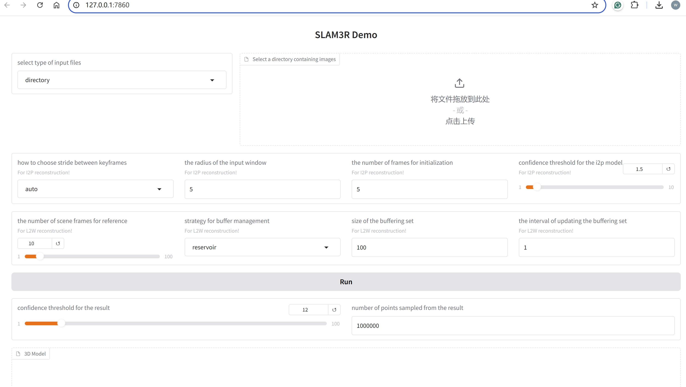

<div align="center">
<h1>测试 （CVPR 2025）SLAM3R: Real-Time Dense Scene Reconstruction from Monocular RGB Videos</h1>
</div>

## 配置测试
```bash
git clone https://github.com/KwanWaiPang/SLAM3R.git


conda create -n slam3r python=3.11 cmake=3.14.0
conda activate slam3r 
# conda remove --name slam3r --all

# install torch according to your cuda version
# pip install torch==2.5.0 torchvision==0.20.0 torchaudio==2.5.0 --index-url https://download.pytorch.org/whl/cu118

# 实验中采用A100 CUDA 12.2
pip install torch==2.5.0 torchvision==0.20.0 torchaudio==2.5.0 --index-url https://download.pytorch.org/whl/cu121


pip install -r requirements.txt
# optional: install additional packages to support visualization （可视化安装包）
pip install -r requirements_vis.txt

```

* Accelerate SLAM3R with XFormers and custom cuda kernels for RoPE (加速器)由于也是采用跟作者一样的torch==2.5.0，因此应该是一样的下载
```bash
# install XFormers according to your pytorch version, see https://github.com/facebookresearch/xformers
pip install xformers==0.0.28.post2
# compile cuda kernels for RoPE
cd slam3r/pos_embed/curope/
python setup.py build_ext --inplace
cd ../../../
```

接下来下载模型(但似乎运行的时候也会自动下载模型，此处先跳过~)
* [I2P](https://huggingface.co/siyan824/slam3r_i2p) 
* [L2W](https://huggingface.co/siyan824/slam3r_l2w)

<div align="center">
  
<figcaption>  
</figcaption>
</div>

然后下载数据[link](https://drive.google.com/file/d/1NmBtJ2A30qEzdwM0kluXJOp2d1Y4cRcO/view?usp=drive_link)或者[link](https://drive.google.com/file/d/1FVLFXgepsqZGkIwg4RdeR5ko_xorKyGt/view?usp=drive_link)

* 关于googledrie下载数据集到服务器请见[博客](https://kwanwaipang.github.io/File/Blogs/Poster/ubuntu%E5%91%BD%E4%BB%A4%E8%A1%8C%E4%B8%8B%E8%BD%BD%E6%95%B0%E6%8D%AE.html#google-driver)
```bash
pip install gdown 
gdown https://drive.google.com/uc?id=标识符

gdown https://drive.google.com/uc?id=1NmBtJ2A30qEzdwM0kluXJOp2d1Y4cRcO
gdown https://drive.google.com/uc?id=1FVLFXgepsqZGkIwg4RdeR5ko_xorKyGt

#下载Replica数据集
wget https://cvg-data.inf.ethz.ch/nice-slam/data/Replica.zip

unzip ***.zip -d dataset/***
```

注意数据集的名字如果改了，对应的`demo_wild.sh`文档里面要改路径

运行测试
```bash
#用open3D来可视化，需要用MobaXterm
cd SLAM3R
conda activate slam3r 
bash scripts/demo_wild.sh

#下面在MobaXterm中运行
bash scripts/demo_vis_wild.sh
```
* 结果会存放在`./results/`文件中

<div align="center">
  
<figcaption>  
</figcaption>
</div>

但是运行可视化还是什么都没有，open3d窗口并没有跳出来~


## 采用Gradio interface测试

vscode运行下面代码
```bash
conda activate slam3r 
python app.py
```
然后打开页面，如下：

<div align="center">
  
<figcaption>  
</figcaption>
</div>

* 测试作者给的Library以及room0数据集的效果如下：

更多可视化效果请见[博客](https://kwanwaipang.github.io/SLAM3R/)

* 先测试室外经典的train数据看看


* 然后测试自己的数据集看看(注意，单张图片或者两张图片都是不能成功的，应该是对于input window的radius有关，默认设置为5)

将`the radius of the input window`和`the number of frames for initialization`改为2看看两个视角下的效果：
